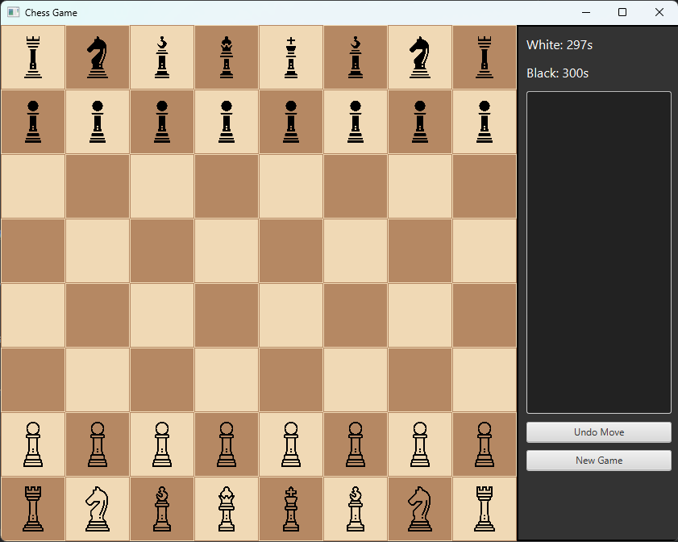

# Chess Game

## Project Overview

Chess Game is a Java-based application for playing chess, utilizing the JavaFX library for graphical user interface (GUI) management. The project allows two players to play a game of chess, following all standard chess rules, including piece movements, check, checkmate, and castling.

## Features
- Full implementation of chess rules
- Graphical User Interface (GUI) using JavaFX
- Visualization of the chessboard and pieces
- Highlighting legal moves
- Pawn promotion
- Castling
- Move undo functionality
- Timer for each player
- Move history in standard chess notation

## Implementation Approach
The project is implemented using an object-oriented programming (OOP) approach, ensuring modularity and maintainability. The main design aspects include:
- **Object-Oriented Structure**: Each piece type (Pawn, Rook, Knight, Bishop, Queen, King) is implemented as a separate class extending a common `Piece` superclass, promoting reusability.
- **Game Management**: The `Game` class orchestrates the game flow, handling turns, move validation, and game state transitions.
- **Board Representation**: The chessboard is managed using a two-dimensional array in the `ChessBoard` class, storing piece positions and tracking game history.
- **Move Validation**: Each piece implements its own move validation logic in the `getLegalMoves` method, ensuring accurate move enforcement.
- **Graphical Interface**: The `ChessGUI` class renders the game board, handles user interactions, and updates the UI dynamically in response to moves.
- **Undo Mechanism**: The `ChessBoard` class maintains a stack of moves, allowing players to revert their last move.

## Project Structure

The project consists of several key classes:
- `ChessGUI.java` - Responsible for the graphical interface, displaying the chessboard, and handling user interactions
- `Game.java` - Core game logic, managing turns, moves, and the overall game state
- `ChessBoard.java` - Represents the chessboard and manages piece movements
- `Piece.java` - Base class for all chess pieces
- `Pawn.java`, `Rook.java`, `Knight.java`, `Bishop.java`, `Queen.java`, `King.java` - Individual piece classes defining unique movement behaviors
- `Move.java` - Encapsulates information about a single move
- `Player.java` - Stores player-specific details
- `Main.java` - Entry point of the application

## Requirements
- Java 11+
- JavaFX

## Installation and Execution
1. Clone the repository:
   ```sh
   git clone https://github.com/YourRepository/ChessGame.git
   ```
2. Navigate to the project directory:
   ```sh
   cd ChessGame
   ```
3. Compile the project:
   ```sh
   javac *.java
   ```
4. Run the game:
   ```sh
   java Main
   ```

## Application Preview


## Future Enhancements
- AI-based opponent for single-player mode
- Online multiplayer functionality
- Advanced game analysis tools
- Integration with chess move databases

Credits

Graphics

Chess piece images used in the game were created by Chess icons created by smalllikeart - Flaticon.

Author

Project created by Oskar Bełza. If you have any questions or suggestions, feel free to reach out!

